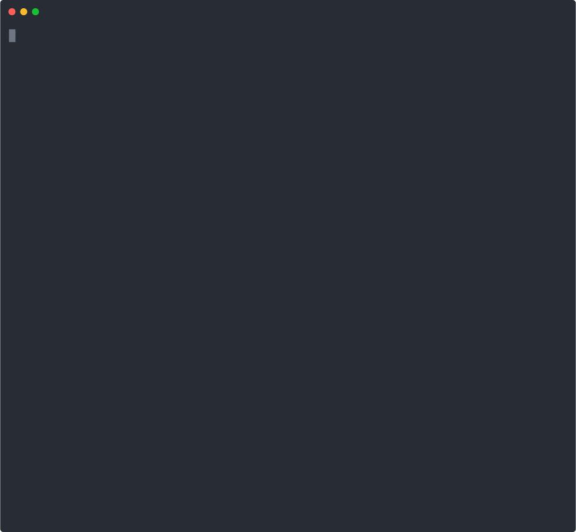

# <h1 align="center"> foundry </h1>


[![Telegram Chat][tg-badge]][tg-url] [![Crates.io][crates-badge]][crates-url]

[crates-badge]: https://img.shields.io/crates/v/foundry.svg
[crates-url]: https://crates.io/crates/foundry-rs
[tg-badge]:
  https://img.shields.io/endpoint?color=neon&style=flat-square&url=https%3A%2F%2Ftg.sumanjay.workers.dev%2Ffoundry_rs
[tg-url]: https://t.me/foundry_rs

**Foundry is a blazing fast, portable and modular toolkit for Ethereum
application development written in Rust.**

Foundry consists of:

- [**Forge**](./forge): Ethereum testing framework (like Truffle, Hardhat and
  Dapptools).
- [**Cast**](./cast): Swiss army knife for interacting with EVM smart contracts,
  sending transactions and getting chain data.

**Need help getting started with Foundry? Read the [📖 Foundry
Book][foundry-book] (WIP)!**

[foundry-book]: https://onbjerg.github.io/foundry-book/



## Installation

First run the command below to get `foundryup`, the Foundry toolchain installer:

```sh
curl -L https://foundry.paradigm.xyz | bash
```

Then, in a new terminal session or after reloading your `PATH`, run it to get
the latest `forge` and `cast` binaries:

```sh
foundryup
```

Advanced ways to use `foundryup`, and other documentation, can be found in the
[foundryup package](./foundryup/README.md). Happy forging!

## Forge

More documentation can be found in the [forge package](./forge/README.md) and in
the [CLI README](./cli/README.md).

### Features

- **Fast & flexible compilation pipeline**
  - Automatic Solidity compiler version detection & installation (under
    `~/.svm`)
  - **Incremental compilation & caching**: Only changed files are re-compiled
  - Parallel compilation
  - Non-standard directory structures support (e.g.
    [Hardhat repos](https://twitter.com/gakonst/status/1461289225337421829))
- **Tests are written in Solidity** (like in DappTools)
- **Fast fuzz testing** with shrinking of inputs & printing of counter-examples
- **Fast remote RPC forking mode**, leveraging Rust's async infrastructure like
  tokio
- **Flexible debug logging**
  - Dapptools-style, using `DsTest`'s emitted logs
  - Hardhat-style, using the popular `console.sol` contract
- **Portable (5-10MB) & easy to install** without requiring Nix or any other
  package manager
- **Fast CI** with the [Foundry GitHub action][foundry-gha].

[foundry-gha]: https://github.com/onbjerg/foundry-toolchain

### How Fast?

Forge is quite fast at both compiling (leveraging the
[ethers-solc](https://github.com/gakonst/ethers-rs/tree/master/ethers-solc/)
package) and testing.

Some benchmarks below:

| Project                                             | Forge | DappTools | Speedup |
| --------------------------------------------------- | ----- | --------- | ------- |
| [guni-lev](https://github.com/hexonaut/guni-lev/)   | 28.6s | 2m36s     | 5.45x   |
| [solmate](https://github.com/Rari-Capital/solmate/) | 6s    | 46s       | 7.66x   |
| [geb](https://github.com/reflexer-labs/geb)         | 11s   | 40s       | 3.63x   |
| [vaults](https://github.com/rari-capital/vaults)    | 1.4s  | 5.5s      | 3.9x    |

It also works with "non-standard" directory structures (i.e. contracts not in
`src/`, libraries not in `lib/`). When
[tested](https://twitter.com/gakonst/status/1461289225337421829) with
[`openzeppelin-contracts`](https://github.com/OpenZeppelin/openzeppelin-contracts),
Hardhat compilation took 15.244s, whereas Forge took 9.449 (~4s cached)

## Cast

Cast is a swiss army knife for interacting with Ethereum applications from the
command line.

More documentation can be found in the [cast package](./cast/README.md).

## Setup

### Configuring Foundry

Foundry is designed to be very configurable. You can create a TOML file called
[`foundry.toml`](./config/README.md) place it in the project or any other parent
directory, and it will apply the options in that file. See
[config package](./config/README.md#all-options) for all available options.

Configurations can be arbitrarily namespaced by profiles. Foundry's default
configuration is also named `default`. The selected profile is the value of the
`FOUNDRY_PROFILE` environment variable, or if it is not set, "default".
`FOUNDRY_` or `DAPP_` prefixed environment variables, like `FOUNDRY_SRC` take
precedence, [see "Default Profile"](./config/README.md#default-profile)

`forge init` creates a basic, extendable `foundry.toml` file.

To set all `.dapprc` env vars run `source .dapprc` beforehand.

To see all currently set options run `forge config`, to only see the basic
options (as set with `forge init`) run `forge config --basic`, this can be used
to create a new `foundry.toml` file with `forge config --basic > foundry.toml`.
By default `forge config` shows the currently selected foundry profile and its
values. It also accepts the same arguments as `forge build`.

### Additional Setup

You can find additional setup guides in the [Foundry Book][foundry-book]:

- [Setting up VSCode][vscode-setup]
- [Shell autocompletions][shell-setup]

[vscode-setup]: https://onbjerg.github.io/foundry-book/guides/vscode.html
[shell-setup]:
  https://onbjerg.github.io/foundry-book/guides/shell-autocompletion.html

### Troubleshooting Installation

#### `libusb` error when running `forge`/`cast`

If you are using the binaries as released, you may see the following error on
MacOS:

```
dyld: Library not loaded: /usr/local/opt/libusb/lib/libusb-1.0.0.dylib
```

In order to fix this, you must install `libusb` like so:

```sh
brew install libusb
```

#### Out of date `GLIBC` error when running `forge` from default `foundryup` install:

If you run into an error resembling the following when using `foundryup`:

```
forge: /lib/x86_64-linux-gnu/libc.so.6: version 'GLIBC_2.29' not found (required by forge)
```

There are 2 workarounds:

1. Build from source using the following command:

```
foundryup -b master
```

2. For a solution using Docker, refer to this article:
   https://kobzol.github.io/rust/ci/2021/05/07/building-rust-binaries-in-ci-that-work-with-older-glibc.html#solution

## Contributing

See our [contributing guidelines](./CONTRIBUTING.md).

## Getting Help

First, see if the answer to your question can be found in the API documentation.
If the answer is not there, try opening an
[issue](https://github.com/gakonst/foundry/issues/new) with the question.

To join the Foundry community, you can use our
[main telegram](https://t.me/foundry_rs) to chat with us!

To receive help with Foundry, you can use our
[support telegram](https://t.me/+pqodMdZCoQQyZGI6) to asky any questions you may
have.

## Acknowledgements

- Foundry is a clean-room rewrite of the testing framework
  [dapptools](https://github.com/dapphub/dapptools). None of this would have
  been possible without the DappHub team's work over the years.
- [Matthias Seitz](https://twitter.com/mattsse_): Created
  [ethers-solc](https://github.com/gakonst/ethers-rs/tree/master/ethers-solc/)
  which is the backbone of our compilation pipeline, as well as countless
  contributions to ethers, in particular the `abigen` macros.
- [Rohit Narurkar](https://twitter.com/rohitnarurkar): Created the Rust Solidity
  version manager [svm-rs](https://github.com/roynalnaruto/svm-rs) which we use
  to auto-detect and manage multiple Solidity versions.
- [Brock Elmore](https://twitter.com/brockjelmore): For extending the VM's
  cheatcodes and implementing
  [structured call tracing](https://github.com/gakonst/foundry/pull/192), a
  critical feature for debugging smart contract calls.
- All the other
  [contributors](https://github.com/gakonst/foundry/graphs/contributors) to the
  [ethers-rs](https://github.com/gakonst/ethers-rs) &
  [foundry](https://github.com/gakonst/foundry) repositories and chatrooms.
