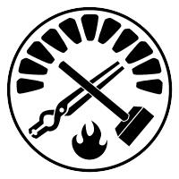
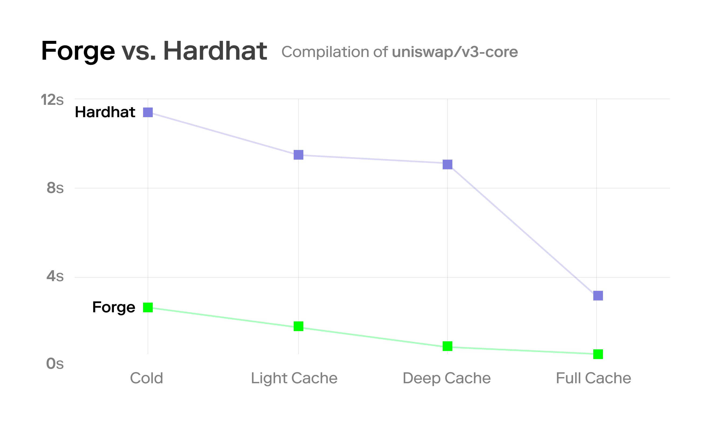

## Foundry

![Github Actions][gha-badge] [![Telegram Chat][tg-badge]][tg-url] [![Telegram Support][tg-support-badge]][tg-support-url]
![Foundry](https://img.shields.io/badge/Foundry-grey?style=flat&logo=data:image/png;base64,iVBORw0KGgoAAAANSUhEUgAAABQAAAAUCAYAAACNiR0NAAAElElEQVR4nH1VUUhUaRg9984YdzBpkqR0Z210rIESIXSabEbcHgydrpNRRj00kWaztj0U1MOW0MOIbD300IvLMqBpMTGYxdoqyoRNDUESBDWwUuPugCSSsTM7u0Oj1/+efdiMcmnP2/fDd77D4f/OB6xCa2urQZbllVICYGtqanK1tLS4AdgAyAAgyzJaW1sNq/ulT4twOGw4fPiwAGDp7Ow8VV1d7bVarRWxWCw/k8mgsbExm0wmZ+Lx+M/Xr1//CcAsSVmSJH01McLhsAEAnE5nx+Tk5B/xeJxOp5N9fX2sqqqixWLhnTt36HA4GIvFGI1GU3V1df5Pe/9D1t7eHkgkEuzo6GBPT49WWloq7Ha7fujQITocDu7atUs3m83i6tWr2okTJ/jixQuePn265zPScDhskGUZe/fubXv8+DFv3rypbdiwQaxbt46RSIT79u3j0NAQb926RVVVOT4+TqvVyvz8fD0YDC5NTk6ysbHxlCRJ/5KSlAAURyKRTFNTkwAg7t69S5/Px76+Pq7GyMgI9+/fz9HRUQIQO3bsEKOjo38DsJCUJADw+/0BVVW7otHo8ps3b4yvXr3CxMQETCYTTCYTNE0DAOTl5SGXy0FRFOzZswdmsxkVFRXLNTU1xmg0+kNvb+/3AGAcGBiI7969Wwcg6urq+OTJE967d49btmzh9PT0R3WJRIKBQIDBYJBTU1NsaGggAGGz2fTe3t5fAeQZAWwuLi4uP3nypOT1emEwGFBeXo7a2losLCygoaEB/f39MJlMCIVCkCQJBw8ehNVqhcfjQXNzs1RSUiKtX7++DEAZqqqq3KFQiABYUFDAM2fOkCQXFxdJkvfv32dhYSG9Xi+vXbvG2dnZj4oDgQCLioqoKAqHhobodDq/Mc7NzUklJSUIBoOw2WzYtm0blpeXsWbNGkxMTODp06doa2vD4OAgNm7cCIvFApLQdR3nzp3Dzp078fLlSxQVFeHdu3cAgIpHjx69/zBUX5k+MDBAt9vNY8eOsbu7m6lUigcOHKDL5WImkyHJz9TGYrEcALsMIPn69esZTdMIgM+ePUNXVxdu376NsrIyuN1uXLp0CWazGcPDw3C5XFBVFWfPnkVNTQ18Pp+ezWY5MzPzO4DfAABHjhzpJslUKqVdvHiR4+PjbG9vZy6XI0kuLS0xmUxSCEGS9Pv9LC0tpdFoZGVlpSaEoM/nuwIAKx/7q5GRkb9CoZBQVVWcP3+ez58/J0mm02kODg7ywoULjMViTKfTtNvtXLt2LTdt2qTncrnlsbGxLICvSUqfrl5HJBLh1NTUkhBCJ8mFhQX29/dTVVUWFBTwwYMH1HWdly9fpqIoeiKRWJqfn2d1dXWnLMuf7zMAHD16tGd+fn7FZy2bzYrKykodAAFQVVV9cXFRkNTevn3Lubk5trS0XPnfxHE4HN8ODw+nV/yanp6mx+Ohx+P5aIMQgmNjY3/W1tZ+t5rsSwG7+fjx4/76+vrm7du32woLC00AkE6n38fj8ZmHDx/+cuPGjR8BJL8YsCtYdQIMALYqilKvKEo9APuHty+egH8A3GfFDJXmxmMAAAAASUVORK5CYII%3D&link=https%3A%2F%2Fbook.getfoundry.sh%2F)

[gha-badge]: https://img.shields.io/github/actions/workflow/status/foundry-rs/foundry/test.yml?branch=master
[tg-badge]: https://img.shields.io/endpoint?color=neon&logo=telegram&label=chat&style=flat-square&url=https%3A%2F%2Ftg.sumanjay.workers.dev%2Ffoundry_rs
[tg-url]: https://t.me/foundry_rs
[tg-support-badge]: https://img.shields.io/endpoint?color=neon&logo=telegram&label=support&style=flat-square&url=https%3A%2F%2Ftg.sumanjay.workers.dev%2Ffoundry_support
[tg-support-url]: https://t.me/foundry_support

**[Install](https://book.getfoundry.sh/getting-started/installation)**
| [User Book](https://book.getfoundry.sh)
| [Developer Docs](./docs/dev/)
| [Crate Docs](https://foundry-rs.github.io/foundry)

**Foundry is a blazing fast, portable and modular toolkit for Ethereum application development written in Rust.**

Foundry consists of:

-   [**Forge**](./crates/forge): Ethereum testing framework (like Truffle, Hardhat and DappTools).
-   [**Cast**](./crates/cast): Swiss army knife for interacting with EVM smart contracts, sending transactions and getting chain data.
-   [**Anvil**](./crates/anvil): Local Ethereum node, akin to Ganache, Hardhat Network.
-   [**Chisel**](./crates/chisel): Fast, utilitarian, and verbose solidity REPL.

**Need help getting started with Foundry? Read the [📖 Foundry Book][foundry-book] (WIP)!**

## Installation

See the [installation guide](https://book.getfoundry.sh/getting-started/installation) in the book.

If you're experiencing any issues while installing, check out [Getting Help](#getting-help) and the [FAQ](https://book.getfoundry.sh/faq).

## Forge

### Features

-   **Fast & flexible compilation pipeline**
    -   Automatic Solidity compiler version detection & installation
    -   **Incremental compilation & caching**: Only changed files are re-compiled
    -   Parallel compilation
    -   Non-standard directory structures support (e.g. [Hardhat repos](https://twitter.com/gakonst/status/1461289225337421829))
-   **Tests are written in Solidity** (like in DappTools)
-   **Fast fuzz testing** with shrinking of inputs & printing of counter-examples
-   **Fast remote RPC forking mode**, leveraging Rust's async infrastructure like tokio
-   **Flexible debug logging**
    -   DappTools-style, using `DsTest`'s emitted logs
    -   Hardhat-style, using the popular `console.sol` contract
-   **Portable (5-10MB) & easy to install** without requiring Nix or any other package manager
-   **Fast CI** with the [Foundry GitHub action][foundry-gha].

### How Fast?

Forge is quite fast at both compiling (leveraging [ethers-solc]) and testing.

See the benchmarks below. More benchmarks can be found in the [v0.2.0 announcement post][benchmark-post] and in the [Convex Shutdown Simulation][convex] repository.

**Testing Benchmarks**

| Project                            | Forge | DappTools | Speedup |
| ---------------------------------- | ----- | --------- | ------- |
| [transmissions11/solmate][solmate] | 2.8s  | 6m34s     | 140x    |
| [reflexer-labs/geb][geb]           | 0.4s  | 23s       | 57.5x   |
| [Rari-Capital/vaults][vaults]      | 0.28s | 6.5s      | 23x     |

_Note: In the above benchmarks, compilation was always skipped_

**Compilation Benchmarks**

**Takeaway: Forge compilation is consistently faster by a factor of 1.7-11.3x, depending on the amount of caching involved.**

## Cast

Cast is a swiss army knife for interacting with Ethereum applications from the command line.

More documentation can be found in the [cast package](./crates/cast).

## Configuration

### Using `foundry.toml`

Foundry is designed to be very configurable. You can configure Foundry using a file called [`foundry.toml`](./crates/config) in the root of your project, or any other parent directory. See [config package](./crates/config/README.md#all-options) for all available options.

Configuration can be arbitrarily namespaced by profiles. The default profile is named `default` (see ["Default Profile"](./crates/config/README.md#default-profile)).

You can select another profile using the `FOUNDRY_PROFILE` environment variable. You can also override parts of your configuration using `FOUNDRY_` or `DAPP_` prefixed environment variables, like `FOUNDRY_SRC`.

`forge init` creates a basic, extendable `foundry.toml` file.

To see your current configuration, run `forge config`. To see only basic options (as set with `forge init`), run `forge config --basic`. This can be used to create a new `foundry.toml` file with `forge config --basic > foundry.toml`.

By default `forge config` shows the currently selected foundry profile and its values. It also accepts the same arguments as `forge build`.

### DappTools Compatibility

You can reuse your `.dapprc` environment variables by running `source .dapprc` before using a Foundry tool.

### Additional Configuration

You can find additional setup and configurations guides in the [Foundry Book][foundry-book]:

-   [Setting up VSCode][vscode-setup]
-   [Shell autocompletions][shell-setup]

## Contributing

See our [contributing guidelines](./CONTRIBUTING.md).

## Getting Help

First, see if the answer to your question can be found in [book][foundry-book], or in the relevant crate.

If the answer is not there:

-   Join the [support Telegram][tg-support-url] to get help, or
-   Open a [discussion](https://github.com/foundry-rs/foundry/discussions/new) with your question, or
-   Open an issue with [the bug](https://github.com/foundry-rs/foundry/issues/new)

If you want to contribute, or follow along with contributor discussion, you can use our [main telegram](https://t.me/foundry_rs) to chat with us about the development of Foundry!

## Acknowledgements

-   Foundry is a clean-room rewrite of the testing framework [DappTools](https://github.com/dapphub/dapptools). None of this would have been possible without the DappHub team's work over the years.
-   [Matthias Seitz](https://twitter.com/mattsse_): Created [ethers-solc] which is the backbone of our compilation pipeline, as well as countless contributions to ethers, in particular the `abigen` macros.
-   [Rohit Narurkar](https://twitter.com/rohitnarurkar): Created the Rust Solidity version manager [svm-rs](https://github.com/roynalnaruto/svm-rs) which we use to auto-detect and manage multiple Solidity versions.
-   [Brock Elmore](https://twitter.com/brockjelmore): For extending the VM's cheatcodes and implementing [structured call tracing](https://github.com/foundry-rs/foundry/pull/192), a critical feature for debugging smart contract calls.
-   All the other [contributors](https://github.com/foundry-rs/foundry/graphs/contributors) to the [ethers-rs](https://github.com/gakonst/ethers-rs) & [foundry](https://github.com/foundry-rs/foundry) repositories and chatrooms.

[foundry-book]: https://book.getfoundry.sh
[foundry-gha]: https://github.com/foundry-rs/foundry-toolchain
[ethers-solc]: https://github.com/gakonst/ethers-rs/tree/master/ethers-solc/
[solmate]: https://github.com/transmissions11/solmate/
[geb]: https://github.com/reflexer-labs/geb
[vaults]: https://github.com/rari-capital/vaults
[benchmark-post]: https://www.paradigm.xyz/2022/03/foundry-02#blazing-fast-compilation--testing
[convex]: https://github.com/mds1/convex-shutdown-simulation
[vscode-setup]: https://book.getfoundry.sh/config/vscode.html
[shell-setup]: https://book.getfoundry.sh/config/shell-autocompletion.html
