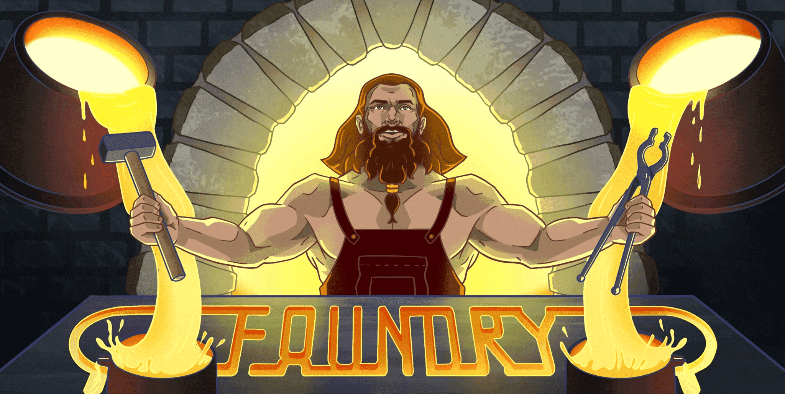
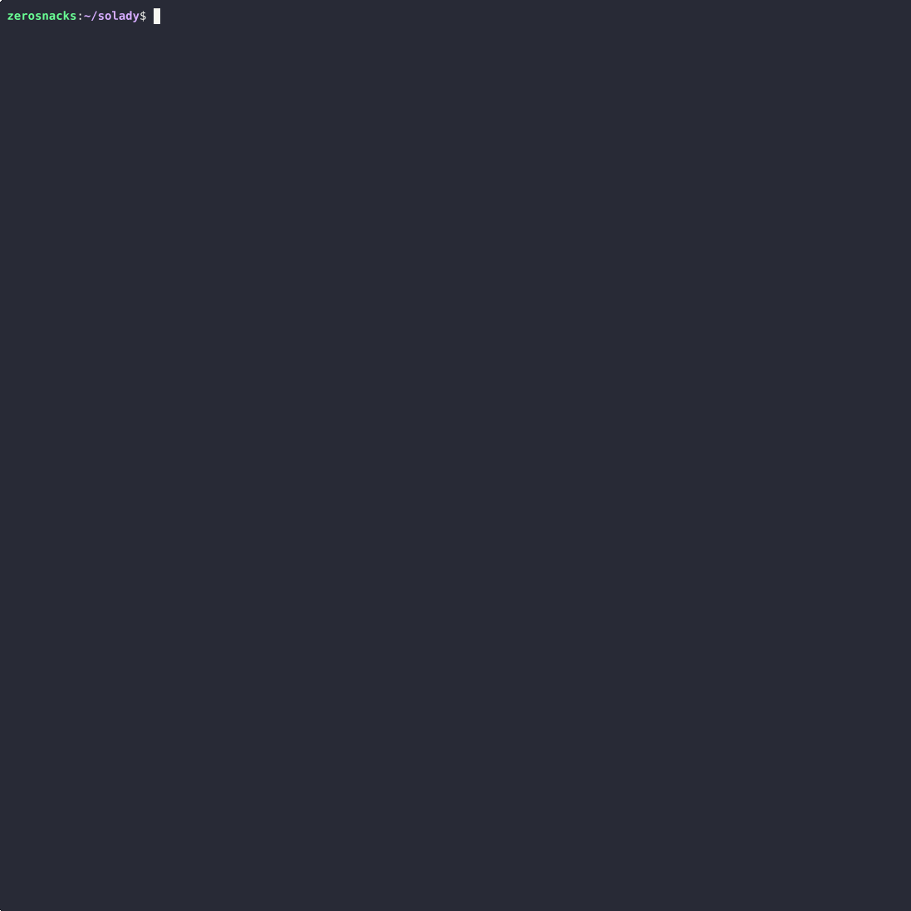

<div align="center">
  

&nbsp;

[![Github Actions][gha-badge]][gha-url] [![Telegram Chat][tg-badge]][tg-url] [![Telegram Support][tg-support-badge]][tg-support-url]

[gha-badge]: https://img.shields.io/github/actions/workflow/status/foundry-rs/foundry/test.yml?branch=master&style=flat-square
[gha-url]: https://github.com/foundry-rs/foundry/actions
[tg-badge]: https://img.shields.io/endpoint?color=neon&logo=telegram&label=chat&style=flat-square&url=https%3A%2F%2Ftg.sumanjay.workers.dev%2Ffoundry_rs
[tg-url]: https://t.me/foundry_rs
[tg-support-badge]: https://img.shields.io/endpoint?color=neon&logo=telegram&label=support&style=flat-square&url=https%3A%2F%2Ftg.sumanjay.workers.dev%2Ffoundry_support
[tg-support-url]: https://t.me/foundry_support

**[Install](https://getfoundry.sh/getting-started/installation)**
| [Docs][foundry-docs]
| [Benchmarks](https://www.getfoundry.sh/benchmarks)
| [Developer Guidelines](./docs/dev/README.md)
| [Contributing](./CONTRIBUTING.md)
| [Crate Docs](https://foundry-rs.github.io/foundry)

</div>

---

Blazing fast, portable and modular toolkit for Ethereum application development, written in Rust.

- [**Forge**](https://getfoundry.sh/forge) — Build, test, fuzz, debug and deploy Solidity contracts.
- [**Cast**](https://getfoundry.sh/cast) — Swiss Army knife for interacting with EVM smart contracts, sending transactions and getting chain data.
- [**Anvil**](https://getfoundry.sh/anvil) — Fast local Ethereum development node.
- [**Chisel**](https://getfoundry.sh/chisel) — Fast, utilitarian and verbose Solidity REPL.



## Installation

```sh
curl -L https://foundry.paradigm.xyz | bash
foundryup
```

See the [installation guide](https://getfoundry.sh/getting-started/installation) for more details.

## Getting Started

Initialize a new project, build and test:

```sh
forge init counter && cd counter
forge build
forge test
```

Interact with a live network:

```sh
cast block-number --rpc-url https://eth.merkle.io
cast balance vitalik.eth --ether --rpc-url https://eth.merkle.io
```

Fork mainnet locally:

```sh
anvil --fork-url https://eth.merkle.io
```

Read the [Foundry Docs][foundry-docs] to learn more.

## Contributing

Contributions are welcome and highly appreciated. To get started, check out the [contributing guidelines](./CONTRIBUTING.md).

Join our [Telegram][tg-url] to chat about the development of Foundry.

## Support

Having trouble? Check the [Foundry Docs][foundry-docs], join the [support Telegram][tg-support-url], or [open an issue](https://github.com/foundry-rs/foundry/issues/new).

#### License

<sup>
Licensed under either of <a href="LICENSE-APACHE">Apache License, Version
2.0</a> or <a href="LICENSE-MIT">MIT license</a> at your option.
</sup>

<br>

<sub>
Unless you explicitly state otherwise, any contribution intentionally submitted
for inclusion in these crates by you, as defined in the Apache-2.0 license,
shall be dual licensed as above, without any additional terms or conditions.
</sub>

[foundry-docs]: https://getfoundry.sh
