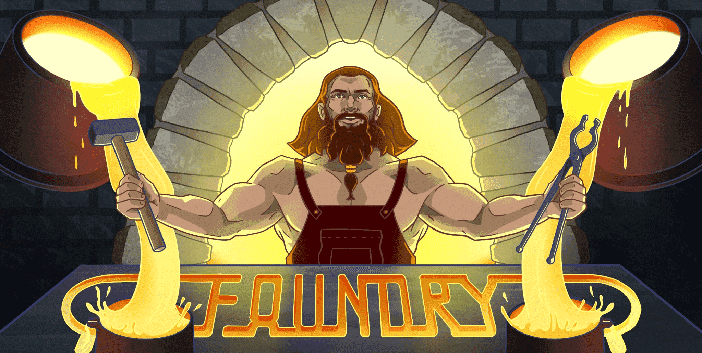
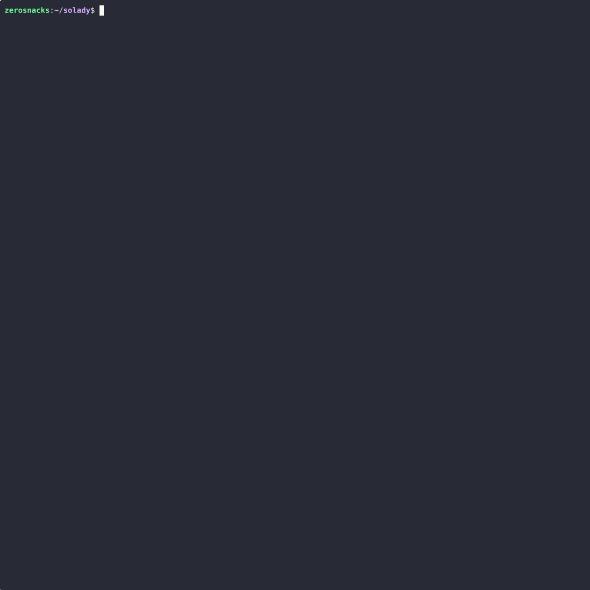

<div align="center">
  

&nbsp;

[![Github Actions][gha-badge]][gha-url] [![Telegram Chat][tg-badge]][tg-url] [![Telegram Support][tg-support-badge]][tg-support-url]

[gha-badge]: https://img.shields.io/github/actions/workflow/status/foundry-rs/foundry/test.yml?branch=master&style=flat-square
[gha-url]: https://github.com/foundry-rs/foundry/actions
[tg-badge]: https://img.shields.io/endpoint?color=neon&logo=telegram&label=chat&style=flat-square&url=https%3A%2F%2Ftg.sumanjay.workers.dev%2Ffoundry_rs
[tg-url]: https://t.me/foundry_rs
[tg-support-badge]: https://img.shields.io/endpoint?color=neon&logo=telegram&label=support&style=flat-square&url=https%3A%2F%2Ftg.sumanjay.workers.dev%2Ffoundry_support
[tg-support-url]: https://t.me/foundry_support

**[Install](https://getfoundry.sh/getting-started/installation)**
| [Docs][foundry-docs]
| [Benchmarks](https://www.getfoundry.sh/benchmarks)
| [Developer Guidelines](./docs/dev/README.md)
| [Contributing](./CONTRIBUTING.md)
| [Crate Docs](https://foundry-rs.github.io/foundry)

</div>

---

Blazing fast, portable and modular toolkit for Ethereum application development, written in Rust.

- [**Forge**](https://getfoundry.sh/forge) — Build, test, fuzz, debug and deploy Solidity contracts.
- [**Cast**](https://getfoundry.sh/cast) — Swiss Army knife for interacting with EVM smart contracts, sending transactions and getting chain data.
- [**Anvil**](https://getfoundry.sh/anvil) — Fast local Ethereum development node.
- [**Chisel**](https://getfoundry.sh/chisel) — Fast, utilitarian and verbose Solidity REPL.



## Installation

```sh
curl -L https://foundry.paradigm.xyz | bash
foundryup
```

See the [installation guide](https://getfoundry.sh/getting-started/installation) for more details.

## Getting Started

Initialize a new project, build and test:

```sh
forge init counter && cd counter
forge build
forge test
```

Interact with a live network:

```sh
cast block-number --rpc-url https://eth.merkle.io
cast balance vitalik.eth --ether --rpc-url https://eth.merkle.io
```

Fork mainnet locally:

```sh
anvil --fork-url https://eth.merkle.io
```

Read the [Foundry Docs][foundry-docs] to learn more.

### Solidity editor integration

With VS Code installed, run `forge lsp` from your Solidity project's terminal.
Forge opens that project in a VS Code Extension Development Host with its bundled
Solidity extension. No Foundry checkout, extension build, or separate Solar
installation is needed. See the [editor guide](editors/README.md) for setup and
client development.

For other editors, configure the Solidity language server command as
`forge lsp --stdio`. Bare `forge lsp` also retains server mode when standard input
is redirected; `forge lsp --vscode` explicitly opens VS Code. Solar uses
`foundry.toml`, workspace folders, remappings, and `evm_version` from the project
automatically.

Solar's default flycheck runs `forge lint --json` with the same Forge executable
that started the server. Solar's existing `initializationOptions.forgePath`
option overrides that executable.

`forge lsp` follows Forge's normal environment setup, global-option parsing, and
command dispatch. In server mode, project dotenv warnings use stderr, leaving
stdout reserved for the LSP transport.

## Contributing

Contributions are welcome and highly appreciated. To get started, check out the [contributing guidelines](./CONTRIBUTING.md).

Join our [Telegram][tg-url] to chat about the development of Foundry.

## Support

Having trouble? Check the [Foundry Docs][foundry-docs], join the [support Telegram][tg-support-url], or [open an issue](https://github.com/foundry-rs/foundry/issues/new).

#### License

<sup>
Licensed under either of <a href="LICENSE-APACHE">Apache License, Version
2.0</a> or <a href="LICENSE-MIT">MIT license</a> at your option.
</sup>

<br>

<sub>
Unless you explicitly state otherwise, any contribution intentionally submitted
for inclusion in these crates by you, as defined in the Apache-2.0 license,
shall be dual licensed as above, without any additional terms or conditions.
</sub>

[foundry-docs]: https://getfoundry.sh


## 🌐 Web Resources & Aesthetic Symbols Index
- [FREEFIRE NAMES](https://zen-spacing-text-68.pages.dev/ru/freefire-names/)
- [TELUGU RIBBON BOWLET](https://pastel-manga-symbols-57.pages.dev/symbol/telugu-ribbon-bowlet/)
- [SYM 26A6](https://zen-aesthetic-fonts-87.pages.dev/symbol/sym-26a6/)
- [SYM 1D440](https://anime-sparkle-text-40.pages.dev/symbol/sym-1d440/)
- [MUSIC WEATHER](https://classic-poetry-fonts-16.pages.dev/vi/music-weather/)
- [GEMINI ZODIAC TWINS](https://clean-spacing-fonts-98.pages.dev/symbol/gemini-zodiac-twins/)
- [SYM 26CF](https://chibi-emoticon-vault-78.pages.dev/symbol/sym-26cf/)
- [SYM 26E2](https://angel-core-bios-50.pages.dev/symbol/sym-26e2/)
- [SYM 1D472](https://neon-futuristic-symbols-58.pages.dev/symbol/sym-1d472/)
- [SYM 2679](https://sleek-mono-symbols-75.pages.dev/symbol/sym-2679/)
- [SYM 1D434](https://mecha-hacker-kaomoji-26.pages.dev/symbol/sym-1d434/)
- [SYM 1F627](https://angelic-bio-symbols-90.pages.dev/symbol/sym-1f627/)
- [SYM 1D410](https://angel-core-bios-50.pages.dev/symbol/sym-1d410/)
- [SYM 1D45A](https://clean-aesthetic-arrows-99.pages.dev/symbol/sym-1d45a/)
- [SYM 26EE](https://chibi-faces-hub-88.pages.dev/symbol/sym-26ee/)
- [SYM 1D49C](https://minimal-star-symbols-28.pages.dev/symbol/sym-1d49c/)
- [WHITE STAR](https://pearl-heart-symbols-95.pages.dev/symbol/white-star/)
- [STARS](https://angel-core-bios-50.pages.dev/ja/stars/)
- [SYM 26FF](https://anime-sparkle-text-70.pages.dev/symbol/sym-26ff/)
- [MUSIC WEATHER](https://anime-sparkle-text-24.pages.dev/vi/music-weather/)
- [SYM 1D44D](https://kawaii-kaomoji-hub-45.pages.dev/symbol/sym-1d44d/)
- [STAR OPERATOR](https://vintage-script-symbols-65.pages.dev/symbol/star-operator/)
- [SYM 26F8](https://kawaii-kaomoji-hub-45.pages.dev/symbol/sym-26f8/)
- [SYM 1F621](https://occult-aesthetic-symbols-26.pages.dev/symbol/sym-1f621/)
- [SYM 2744](https://fairy-lace-symbols-92.pages.dev/symbol/sym-2744/)
- [SYM 1D410](https://gothic-bio-fonts-24.pages.dev/symbol/sym-1d410/)
- [SYM 262D](https://baroque-font-vault-96.pages.dev/symbol/sym-262d/)
- [SYM 2657](https://pearl-heart-symbols-95.pages.dev/symbol/sym-2657/)
- [SYM 1F910](https://neon-futuristic-symbols-20.pages.dev/symbol/sym-1f910/)
- [RU](https://neon-glitch-fonts-20.pages.dev/ru/)
- [WINGED ANGELIC COQUETTE HEART](https://aesthetic-bullet-points-76.pages.dev/symbol/winged-angelic-coquette-heart/)
- [SYM 1D478](https://angelic-bio-symbols-59.pages.dev/symbol/sym-1d478/)
- [SYM 1F496](https://matrix-glitch-text-84.pages.dev/symbol/sym-1f496/)
- [SYM 26ED](https://moe-star-kaomoji-60.pages.dev/symbol/sym-26ed/)
- [ROBLOX NAMES](https://coquette-aesthetic-symbols-58.pages.dev/pt/roblox-names/)
- [SYM 1D479](https://mecha-hacker-kaomoji-26.pages.dev/symbol/sym-1d479/)
- [SYM 1F60E](https://cyber-clan-tags-36.pages.dev/symbol/sym-1f60e/)
- [SYM 26F5](https://pearl-heart-symbols-95.pages.dev/symbol/sym-26f5/)
- [SYM 2625](https://coquette-aesthetic-symbols-84.pages.dev/symbol/sym-2625/)
- [CANCER ZODIAC CRAB](https://cyber-clan-tags-90.pages.dev/symbol/cancer-zodiac-crab/)
- [SYM 263A](https://vintage-angel-text-38.pages.dev/symbol/sym-263a/)
- [SYM 2637](https://soft-angel-symbols-61.pages.dev/symbol/sym-2637/)
- [NATURE FLOWERS](https://soft-angel-symbols-61.pages.dev/vi/nature-flowers/)
- [SYM 1F495](https://cyber-clan-tags-90.pages.dev/symbol/sym-1f495/)
- [SYM 1D456](https://vintage-angel-text-38.pages.dev/symbol/sym-1d456/)
- [SYM 2748](https://chibi-flower-emoticons-63.pages.dev/symbol/sym-2748/)
- [SYM 1D482](https://mecha-matrix-symbols-75.pages.dev/symbol/sym-1d482/)
- [SYM 26A8](https://vintage-lace-symbols-54.pages.dev/symbol/sym-26a8/)
- [SYM 1F47F](https://cyber-clan-tags-90.pages.dev/symbol/sym-1f47f/)
- [SYM 26FE](https://neon-glitch-fonts-25.pages.dev/symbol/sym-26fe/)
- [SYM 1D468](https://pastel-manga-symbols-57.pages.dev/symbol/sym-1d468/)
- [HEARTS](https://lace-and-ribbon-text-61.pages.dev/es/hearts/)
- [SYM 2741](https://minimal-star-symbols-95.pages.dev/symbol/sym-2741/)
- [SYM 1F49A](https://lace-and-ribbon-text-61.pages.dev/symbol/sym-1f49a/)
- [PINWHEEL STAR](https://zen-unicode-symbols-89.pages.dev/symbol/pinwheel-star/)
- [SYM 26F3](https://anime-sparkle-text-70.pages.dev/symbol/sym-26f3/)
- [LITTLE CAT PAWS KAOMOJI](https://pastel-moe-emoticons-55.pages.dev/symbol/little-cat-paws-kaomoji/)
- [SAGITTARIUS ZODIAC ARCHER](https://occult-rune-symbols-64.pages.dev/symbol/sagittarius-zodiac-archer/)
- [SYM 26B4](https://pastel-manga-symbols-57.pages.dev/symbol/sym-26b4/)
- [SYM 1D459](https://vintage-angel-text-38.pages.dev/symbol/sym-1d459/)
- [SYM 2741](https://clean-aesthetic-arrows-99.pages.dev/symbol/sym-2741/)
- [GEORGIAN LOVE HEART](https://minimal-star-symbols-95.pages.dev/symbol/georgian-love-heart/)
- [SYM 26BB](https://anime-sparkle-text-70.pages.dev/symbol/sym-26bb/)
- [SYM 1D421](https://angelic-bio-symbols-90.pages.dev/symbol/sym-1d421/)
- [BRACKETS](https://daintystar-font-studio-48.pages.dev/pt/brackets/)
- [SYM 2686](https://gothic-bio-fonts-14.pages.dev/symbol/sym-2686/)
- [SYM 2724](https://synthwave-text-vault-95.pages.dev/symbol/sym-2724/)
- [SYM 1D425](https://gothic-bio-fonts-81.pages.dev/symbol/sym-1d425/)
- [SYM 1D4A1](https://gothic-bio-fonts-81.pages.dev/symbol/sym-1d4a1/)
- [SYM 26B9](https://kawaii-kaomoji-hub-45.pages.dev/symbol/sym-26b9/)
- [SYM 1F910](https://kawaii-kaomoji-hub-97.pages.dev/symbol/sym-1f910/)
- [SYM 1D412](https://zen-unicode-text-36.pages.dev/symbol/sym-1d412/)
- [SYM 26BB](https://pastel-princess-fonts-68.pages.dev/symbol/sym-26bb/)
- [SYM 1F92D](https://anime-sparkle-text-81.pages.dev/symbol/sym-1f92d/)
- [SYM 1D41A](https://kawaii-kaomoji-hub-45.pages.dev/symbol/sym-1d41a/)
- [SYM 1D451](https://zen-unicode-text-36.pages.dev/symbol/sym-1d451/)
- [SYM 263B](https://coquette-aesthetic-symbols-84.pages.dev/symbol/sym-263b/)
- [SYM 1F972](https://occult-runic-fonts-23.pages.dev/symbol/sym-1f972/)
- [SYM 1F600](https://zen-unicode-text-36.pages.dev/symbol/sym-1f600/)
- [GAMING WEAPONS](https://lace-and-ribbon-text-61.pages.dev/ja/gaming-weapons/)
- [SYM 2749](https://minimal-star-symbols-28.pages.dev/symbol/sym-2749/)
- [SYM 26C9](https://neon-matrix-symbols-94.pages.dev/symbol/sym-26c9/)
- [SYM 1D47C](https://zen-unicode-symbols-89.pages.dev/symbol/sym-1d47c/)
- [SYM 1F494](https://sleek-bio-symbols-40.pages.dev/symbol/sym-1f494/)
- [TRENDING](https://minimal-star-symbols-28.pages.dev/trending/)
- [SYM 1D424](https://minimal-star-symbols-43.pages.dev/symbol/sym-1d424/)
- [SYM 2721](https://pearl-heart-symbols-95.pages.dev/symbol/sym-2721/)
- [SYM 260C](https://kawaii-kaomoji-hub-77.pages.dev/symbol/sym-260c/)
- [SYM 2764 FE0F 200D 1F525](https://angelic-ribbon-text-78.pages.dev/symbol/sym-2764-fe0f-200d-1f525/)
- [SYM 1D44D](https://sleek-bio-symbols-40.pages.dev/symbol/sym-1d44d/)
- [SYM 1D473](https://anime-sparkle-text-81.pages.dev/symbol/sym-1d473/)
- [INSTAGRAM BIO](https://neon-futuristic-symbols-20.pages.dev/instagram-bio/)
- [SYM 1D412](https://chibi-faces-hub-88.pages.dev/symbol/sym-1d412/)
- [MUSIC WEATHER](https://anime-sparkle-text-24.pages.dev/music-weather/)
- [SYM 265F](https://zen-unicode-text-36.pages.dev/symbol/sym-265f/)
- [SYM 1FAE8](https://coquette-aesthetic-symbols-45.pages.dev/symbol/sym-1fae8/)
- [SYM 1FAE5](https://pearl-heart-symbols-95.pages.dev/symbol/sym-1fae5/)
- [SYM 26D6](https://anime-sparkle-text-70.pages.dev/symbol/sym-26d6/)
- [SYM 1D489](https://gothic-bio-fonts-81.pages.dev/symbol/sym-1d489/)
- [SYM 1F602](https://anime-sparkle-text-70.pages.dev/symbol/sym-1f602/)
- [EIGHT POINTED STAR](https://cyber-clan-tags-65.pages.dev/symbol/eight-pointed-star/)
- [SYM 2637](https://pastel-manga-symbols-57.pages.dev/symbol/sym-2637/)
- [SYM 1D462](https://pastel-princess-fonts-68.pages.dev/symbol/sym-1d462/)
- [SYM 1D424](https://occult-rune-symbols-64.pages.dev/symbol/sym-1d424/)
- [SYM 2639 FE0F](https://occult-rune-symbols-64.pages.dev/symbol/sym-2639-fe0f/)
- [LEFT POINTING DOUBLE ANGLE QUOTATION](https://zen-unicode-text-36.pages.dev/symbol/left-pointing-double-angle-quotation/)
- [SYM 1D41D](https://aesthetic-bullet-points-76.pages.dev/symbol/sym-1d41d/)
- [TRENDING](https://minimal-star-symbols-95.pages.dev/es/trending/)
- [SYM 1D49F](https://vintage-angel-text-38.pages.dev/symbol/sym-1d49f/)
- [SYM 1D485](https://cyber-clan-tags-68.pages.dev/symbol/sym-1d485/)
- [SYM 1D494](https://minimal-star-symbols-89.pages.dev/symbol/sym-1d494/)
- [BRACKETS](https://daintystar-font-studio-48.pages.dev/ru/brackets/)
- [SYM 1F494](https://minimal-star-symbols-43.pages.dev/symbol/sym-1f494/)
- [SYM 2638](https://occult-rune-symbols-64.pages.dev/symbol/sym-2638/)
- [FREEFIRE NAMES](https://angelic-ribbon-text-78.pages.dev/es/freefire-names/)
- [SYM 26D7](https://anime-sparkle-text-70.pages.dev/symbol/sym-26d7/)
- [SYM 1D463](https://manga-bubble-symbols-94.pages.dev/symbol/sym-1d463/)
- [SYM 2725](https://cyber-clan-tags-90.pages.dev/symbol/sym-2725/)
- [SYM 2721](https://cyber-clan-tags-90.pages.dev/symbol/sym-2721/)
- [SYM 1F493](https://anime-sparkle-text-24.pages.dev/symbol/sym-1f493/)
- [SYM 2638](https://minimal-star-symbols-43.pages.dev/symbol/sym-2638/)
- [SYM 1F92F](https://vintage-library-text-15.pages.dev/symbol/sym-1f92f/)
- [INSTAGRAM BIO](https://anime-sparkle-text-70.pages.dev/ja/instagram-bio/)
- [SYM 26F9](https://cyber-clan-tags-36.pages.dev/symbol/sym-26f9/)
- [SYM 1F479](https://zen-unicode-text-36.pages.dev/symbol/sym-1f479/)
- [SYM 2681](https://alchemy-occult-symbols-55.pages.dev/symbol/sym-2681/)
- [SYM 1FA75](https://anime-sparkle-text-50.pages.dev/symbol/sym-1fa75/)
- [SUPER SHY BLUSHING KAOMOJI](https://coquette-aesthetic-symbols-58.pages.dev/symbol/super-shy-blushing-kaomoji/)
- [SYM 1FAE4](https://minimal-star-symbols-95.pages.dev/symbol/sym-1fae4/)
- [SYM 26F4](https://anime-sparkle-text-24.pages.dev/symbol/sym-26f4/)
