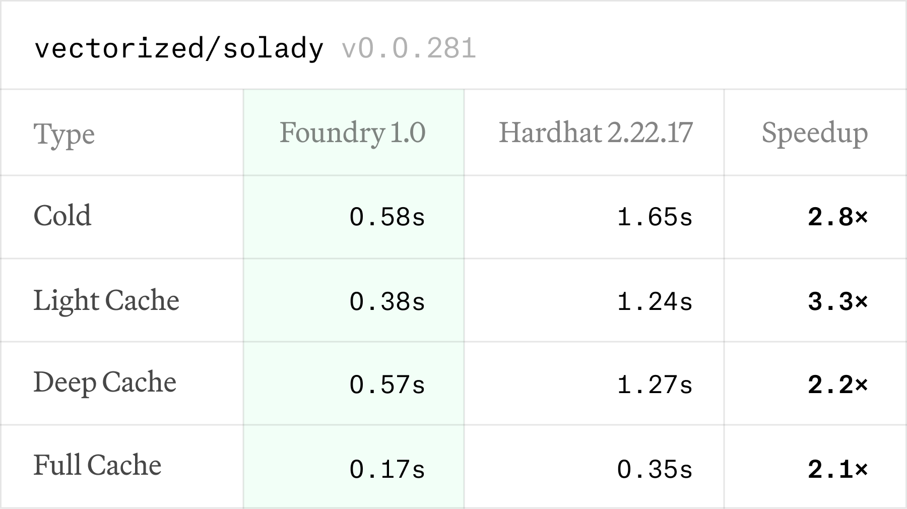
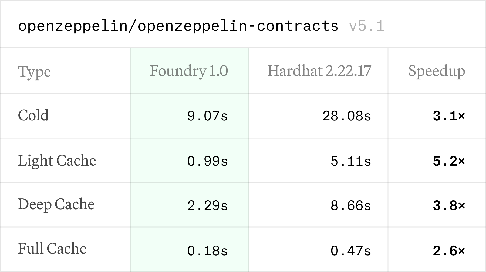

# Differences Between Foundry and Foundry-Polkadot

> ⚠️ Important:</strong> Only this section is up-to-date and should be considered the correct source of documentation. All other sections may be outdated or inaccurate.</span>

This section outlines the key differences between the original Foundry toolkit ([Foundry](https://github.com/foundry-rs/foundry)) and the ParityTech Foundry-Polkadot ([Foundry-Polkadot](https://github.com/paritytech/foundry-polkadot)). **It is intended for developers already familiar with Foundry who are interested in using the Foundry-Polkadot for Polkadot blockchain development.** The focus is on new features, changes, and unsupported functionalities in the Foundry-Polkadot, emphasizing its adaptation for Polkadot.

## 1. Installation instruction

Foundryup-polkadot is the official installer for the Foundry toolchain. To install `foundryup-polkadot`, open your terminal and run the following command:

```bash
curl -L https://raw.githubusercontent.com/paritytech/foundry-polkadot/refs/heads/master/foundryup/install | bash
```

This will install `foundryup-polkadot`. Simply follow the on-screen instructions, and the `foundryup-polkadot` command will become available in your CLI.

Running `foundryup-polkadot` will automatically install the latest version of the [precompiled binaries](https://github.com/paritytech/foundry-polkadot/releases): forge, cast. For additional options, such as installing a specific version or commit, run `foundryup-polkadot --help`.

ℹ️ Note: if you're using Windows, you'll need to install and use [Git BASH](https://gitforwindows.org/) or [WSL](https://learn.microsoft.com/en-us/windows/wsl/install) as your terminal, since Foundryup currently doesn't support Powershell or Command Prompt (CMD).

## 2. Resolc Compiler Integration

**Purpose**: The main addition in the Foundry-Polkadot is support for compiling Solidity contracts targeting Polkadot, using the Resolc compiler to generate PolkaVM-compatible bytecode. This contrasts with the original Foundry's use of the Solc compiler for Ethereum's EVM.

**Usage**:

- **Command-Line Flag**: For commands that involve compilation (e.g., `forge build`), you can use the `--resolc` flag to enable Resolc compilation. For example:

  ```bash
  forge build --resolc
  ```

  This instructs Forge to use Resolc instead of Solc, generating bytecode compatible with PolkaVM.
- **Configuration**: Alternatively, you can configure Resolc usage in the `foundry.toml` file by adding:

  ```toml
  [profile.default.resolc]
  resolc_compile = true
  ```

Setting `resolc_compile = false` reverts to using Solc, ensuring compatibility with Ethereum projects. By default, Foundry-Polkadot uses Solc unless Resolc is explicitly enabled.

When using Resolc, you get access to options that are specific to the Resolc compiler:

```bash
Resolc configuration:
      --resolc-compile
          Enable compiling with resolc
          
          [aliases: resolc]

      --use-resolc <RESOLC_VERSION>
          Specify the resolc version, or a path to a local resolc, to build with.
          
          Valid values follow the SemVer format `x.y.z-dev.n`, `resolc:x.y.z-dev.n` or `path/to/resolc`.

  -O, --resolc-optimizer-mode <LEVEL>
          Set the resolc optimization mode `-O[0 | 1 | 2 | 3 | s | z]`
          
          [aliases: resolc-optimization]

      --heap-size <SIZE>
          Set the contracts heap size in bytes

      --stack-size <SIZE>
          Set the contracts total stack size in bytes

      --debug-info
          Generate source based debug information in the output code file
```

## 3. Command-Line Interface

**Subcommands**: Foundry-Polkadot currently supports a wide range of subcommands under `forge` ([Forge Commands](./README.forge.md)) and `cast` ([Cast Commands](./README.cast.md)).

**Potential Differences**: Commands relying on compilation (e.g., `create`, `bind`, `build`, `inspect`) in Foundry-Polkadot can use Resolc, altering their output compared to the original Foundry.

## 4. Unsupported (yet) or Modified Features

**Known Issues**:

- compilation from yul is not supported
- [factory contracts deployment support](https://github.com/paritytech/foundry-polkadot/issues/130)

**Potential Unsupported Features**: Support for Anvil and Chisel is not available, which also means commands like `forge test`, `forge snapshot`, and `forge script` are not currently supported.

**Modified Features**:

- Compilation output: When using Resolc, the bytecode differs from Solc's output, reflecting PolkaVM's requirements.

## 5. Additional (Contextual) Repositories

Foundry-Polkadot is part of ParityTech's ecosystem, which includes related repositories:

- **paritytech/revive**: Hosts the Resolc compiler, providing the backend for Polkadot-targeted Solidity compilation ([Revive Repository](https://github.com/paritytech/revive)).
- **paritytech/foundry-compilers-polkadot**: Utilities for working with compilers, potentially including Resolc, though primarily focused on Solc ([Foundry Compilers Polkadot](https://github.com/paritytech/foundry-compilers-polkadot)).

These repositories may contain additional tools or documentation relevant to Foundry-Polkadot's functionality.

---

<div align="center">
  

&nbsp;

[![Github Actions][gha-badge]][gha-url] [![Telegram Chat][tg-badge]][tg-url] [![Telegram Support][tg-support-badge]][tg-support-url]
![Foundry](https://img.shields.io/badge/Foundry-grey?style=flat&logo=data:image/png;base64,iVBORw0KGgoAAAANSUhEUgAAABQAAAAUCAYAAACNiR0NAAAElElEQVR4nH1VUUhUaRg9984YdzBpkqR0Z210rIESIXSabEbcHgydrpNRRj00kWaztj0U1MOW0MOIbD300IvLMqBpMTGYxdoqyoRNDUESBDWwUuPugCSSsTM7u0Oj1/+efdiMcmnP2/fDd77D4f/OB6xCa2urQZbllVICYGtqanK1tLS4AdgAyAAgyzJaW1sNq/ulT4twOGw4fPiwAGDp7Ow8VV1d7bVarRWxWCw/k8mgsbExm0wmZ+Lx+M/Xr1//CcAsSVmSJH01McLhsAEAnE5nx+Tk5B/xeJxOp5N9fX2sqqqixWLhnTt36HA4GIvFGI1GU3V1df5Pe/9D1t7eHkgkEuzo6GBPT49WWloq7Ha7fujQITocDu7atUs3m83i6tWr2okTJ/jixQuePn265zPScDhskGUZe/fubXv8+DFv3rypbdiwQaxbt46RSIT79u3j0NAQb926RVVVOT4+TqvVyvz8fD0YDC5NTk6ysbHxlCRJ/5KSlAAURyKRTFNTkwAg7t69S5/Px76+Pq7GyMgI9+/fz9HRUQIQO3bsEKOjo38DsJCUJADw+/0BVVW7otHo8ps3b4yvXr3CxMQETCYTTCYTNE0DAOTl5SGXy0FRFOzZswdmsxkVFRXLNTU1xmg0+kNvb+/3AGAcGBiI7969Wwcg6urq+OTJE967d49btmzh9PT0R3WJRIKBQIDBYJBTU1NsaGggAGGz2fTe3t5fAeQZAWwuLi4uP3nypOT1emEwGFBeXo7a2losLCygoaEB/f39MJlMCIVCkCQJBw8ehNVqhcfjQXNzs1RSUiKtX7++DEAZqqqq3KFQiABYUFDAM2fOkCQXFxdJkvfv32dhYSG9Xi+vXbvG2dnZj4oDgQCLioqoKAqHhobodDq/Mc7NzUklJSUIBoOw2WzYtm0blpeXsWbNGkxMTODp06doa2vD4OAgNm7cCIvFApLQdR3nzp3Dzp078fLlSxQVFeHdu3cAgIpHjx69/zBUX5k+MDBAt9vNY8eOsbu7m6lUigcOHKDL5WImkyHJz9TGYrEcALsMIPn69esZTdMIgM+ePUNXVxdu376NsrIyuN1uXLp0CWazGcPDw3C5XFBVFWfPnkVNTQ18Pp+ezWY5MzPzO4DfAABHjhzpJslUKqVdvHiR4+PjbG9vZy6XI0kuLS0xmUxSCEGS9Pv9LC0tpdFoZGVlpSaEoM/nuwIAKx/7q5GRkb9CoZBQVVWcP3+ez58/J0mm02kODg7ywoULjMViTKfTtNvtXLt2LTdt2qTncrnlsbGxLICvSUqfrl5HJBLh1NTUkhBCJ8mFhQX29/dTVVUWFBTwwYMH1HWdly9fpqIoeiKRWJqfn2d1dXWnLMuf7zMAHD16tGd+fn7FZy2bzYrKykodAAFQVVV9cXFRkNTevn3Lubk5trS0XPnfxHE4HN8ODw+nV/yanp6mx+Ohx+P5aIMQgmNjY3/W1tZ+t5rsSwG7+fjx4/76+vrm7du32woLC00AkE6n38fj8ZmHDx/+cuPGjR8BJL8YsCtYdQIMALYqilKvKEo9APuHty+egH8A3GfFDJXmxmMAAAAASUVORK5CYII%3D&link=https%3A%2F%2Fbook.getfoundry.sh%2F)

[gha-badge]: https://img.shields.io/github/actions/workflow/status/foundry-rs/foundry/test.yml?branch=master
[gha-url]: https://github.com/foundry-rs/foundry/actions
[tg-badge]: https://img.shields.io/endpoint?color=neon&logo=telegram&label=chat&style=flat-square&url=https%3A%2F%2Ftg.sumanjay.workers.dev%2Ffoundry_rs
[tg-url]: https://t.me/foundry_rs
[tg-support-badge]: https://img.shields.io/endpoint?color=neon&logo=telegram&label=support&style=flat-square&url=https%3A%2F%2Ftg.sumanjay.workers.dev%2Ffoundry_support
[tg-support-url]: https://t.me/foundry_support

**[Install](https://paritytech.github.io/foundry-book-polkadot/getting-started/installation)**
| [User Book][foundry-book]
| [Developer Docs](./docs/dev/README.md)
| [Contributing](./CONTRIBUTING.md)
| [Crate Docs](https://foundry-rs.github.io/foundry)

</div>

---

### Foundry is a blazing fast, portable and modular toolkit for Ethereum application development written in Rust.

Foundry consists of:

- [**Forge**](#forge): Build, test, fuzz, debug and deploy [Solidity][solidity] contracts, like Hardhat, Brownie, Ape.
- [**Cast**](#cast): A Swiss Army knife for interacting with EVM smart contracts, sending transactions and getting chain data.
- [**Anvil**](#anvil): Fast local Ethereum development node, akin to Hardhat Network, Tenderly.
- [**Chisel**](#chisel): Fast, utilitarian, and verbose Solidity REPL.

**Need help getting started with Foundry? Read the [📖 Foundry Docs][foundry-docs]!**


## Features

- **High-Performance Compilation**

  - **Fast and Flexible**: Automatically detects and installs the required Solidity compiler version.
  - **Solidity and Vyper Support**: Fully supports both Solidity and Vyper out-of-the-box.
  - **Incremental Compilation**: Re-compiles only changed files, saving time.
  - **Parallelized Pipeline**: Leverages multi-core systems for ultra-fast builds.
  - **Broad Compatibility**: Supports non-standard directory structures, including [Hardhat repos](https://twitter.com/gakonst/status/1461289225337421829).

- **Advanced Testing**

  - **No Context Switching**: Write tests directly in Solidity.
  - **Fuzz Testing**: Quickly identify edge cases with input shrinking and counter-example generation.
  - **Invariant Testing**: Ensure complex system properties hold across a wide range of inputs.
  - **Debugging Made Easy**: Use [forge-std](https://github.com/foundry-rs/forge-std)'s `console.sol` for flexible debug logging.
  - **Interactive Debugger**: Step through your Solidity code with Foundry's interactive debugger, making it easy to pinpoint issues.

- **Powerful Runtime Features**

  - **RPC Forking**: Fast and efficient remote RPC forking backed by [Alloy][alloy].
  - **Lightweight & Portable**: No dependency on Nix or other package managers for installation.

- **Streamlined CI/CD**

  - **Optimized CI**: Accelerate builds, run tests and execute scripts using [Foundry's GitHub action][foundry-gha].

## Installation

Getting started is very easy:

Install `foundryup-polkadot`:

```
curl -L https://raw.githubusercontent.com/paritytech/foundry-polkadot/refs/heads/master/foundryup/install | bash
```

Next, run `foundryup-polkadot`.

It will automatically install the latest version of the precompiled binaries: [`forge`](#forge), [`cast`](#cast).

```
foundryup-polkadot
```

**Done!**

For additional details see the [installation guide](https://paritytech.github.io/foundry-book-polkadot/getting-started/installation) in the [Foundry Book][foundry-book].

If you're experiencing any issues while installing, check out [Getting Help](#getting-help) and the [FAQ](https://paritytech.github.io/foundry-book-polkadot/faq).

## How Fast?

Forge is quite fast at both compiling (leveraging `solc` with [foundry-compilers]) and testing.

See the benchmarks below. Older benchmarks against [DappTools][dapptools] can be found in the [v0.2.0 announcement post][benchmark-post] and in the [Convex Shutdown Simulation][convex] repository.

### Testing Benchmarks

| Project                                       | Type                 | [Forge 1.0][foundry-1.0] | [Forge 0.2][foundry-0.2] | DappTools | Speedup        |
| --------------------------------------------- | -------------------- | ------------------------ | ------------------------ | --------- | -------------- |
| [vectorized/solady][solady]                   | Unit / Fuzz          | 0.9s                     | 2.3s                     | -         | 2.6x           |
| [morpho-org/morpho-blue][morpho-blue]         | Invariant            | 0.7s                     | 1m43s                    | -         | 147.1x         |
| [morpho-org/morpho-blue-oracles][morpho-blue] | Integration (Cold)   | 6.1s                     | 6.3s                     | -         | 1.04x          |
| [morpho-org/morpho-blue-oracles][morpho-blue] | Integration (Cached) | 0.6s                     | 0.9s                     | -         | 1.50x          |
| [transmissions11/solmate][solmate]            | Unit / Fuzz          | 2.7s                     | 2.8s                     | 6m34s     | 1.03x / 140.0x |
| [reflexer-labs/geb][geb]                      | Unit / Fuzz          | 0.2s                     | 0.4s                     | 23s       | 2.0x / 57.5x   |

_In the above benchmarks, compilation was always skipped_

**Takeaway: Forge dramatically outperforms the competition, delivering blazing-fast execution speeds while continuously expanding its robust feature set.**

### Compilation Benchmarks

<div align="center">
  <picture>
    <source media="(prefers-color-scheme: dark)" srcset=".github/assets/build_benchmark_solady_dark.png" width="600px">
    
  </picture>

<picture>
    <source media="(prefers-color-scheme: dark)" srcset=".github/assets/build_benchmark_openzeppelin_dark.png" width="600px">
    
  </picture>

&nbsp;

</div>

**Takeaway: Forge compilation is consistently faster than Hardhat by a factor of `2.1x` to `5.2x`, depending on the amount of caching involved.**

## Forge

Forge helps you build, test, fuzz, debug and deploy Solidity contracts.

The best way to understand Forge is to simply try it (in less than 30 seconds!).

First, let's initialize a new `counter` example repository:

```sh
forge init counter
```

Next `cd` into `counter` and build :

```sh
forge build
```

```console
[⠊] Compiling...
[⠔] Compiling 27 files with Solc 0.8.28
[⠒] Solc 0.8.28 finished in 452.13ms
Compiler run successful!
```

Let's [test](https://paritytech.github.io/foundry-book-polkadot/forge/tests#tests) our contracts:

```sh
forge test
```

```console
[⠊] Compiling...
No files changed, compilation skipped

Ran 2 tests for test/Counter.t.sol:CounterTest
[PASS] testFuzz_SetNumber(uint256) (runs: 256, μ: 31121, ~: 31277)
[PASS] test_Increment() (gas: 31293)
Suite result: ok. 2 passed; 0 failed; 0 skipped; finished in 5.35ms (4.86ms CPU time)

Ran 1 test suite in 5.91ms (5.35ms CPU time): 2 tests passed, 0 failed, 0 skipped (2 total tests)
```

Finally, let's run our deployment script:

```sh
forge script script/Counter.s.sol
```

```console
[⠊] Compiling...
No files changed, compilation skipped
Script ran successfully.
Gas used: 109037

If you wish to simulate on-chain transactions pass a RPC URL.
```

Run `forge --help` to explore the full list of available subcommands and their usage.

More documentation can be found in the [forge](https://getfoundry.sh/forge/overview) section of the Foundry Docs.

## Cast

Cast is a Swiss Army knife for interacting with Ethereum applications from the command line.

Here are a few examples of what you can do:

**Check the latest block on Ethereum Mainnet**:

```sh
cast block-number --rpc-url https://eth.merkle.io
```

**Check the Ether balance of `vitalik.eth`**

```sh
cast balance vitalik.eth --ether --rpc-url https://eth.merkle.io
```

**Replay and trace a transaction**

```sh
cast run 0x9c32042f5e997e27e67f82583839548eb19dc78c4769ad6218657c17f2a5ed31 --rpc-url https://eth.merkle.io
```

Optionally, pass `--etherscan-api-key <API_KEY>` to decode transaction traces using verified source maps, providing more detailed and human-readable information.

---

Run `cast --help` to explore the full list of available subcommands and their usage.

More documentation can be found in the [cast](https://getfoundry.sh/cast/overview) section of the Foundry Docs.

## Anvil

Anvil is a fast local Ethereum development node.

Let's fork Ethereum mainnet at the latest block:

```sh
anvil --fork-url https://eth.merkle.io
```

You can use those same `cast` subcommands against your `anvil` instance:

```sh
cast block-number
```

---

Run `anvil --help` to explore the full list of available features and their usage.

More documentation can be found in the [anvil](https://getfoundry.sh/anvil/overview) section of the Foundry Docs.

## Chisel

Chisel is a fast, utilitarian, and verbose Solidity REPL.

To use Chisel, simply type `chisel`.

```sh
chisel
```

From here, start writing Solidity code! Chisel will offer verbose feedback on each input.

Create a variable `a` and query it:

```console
➜ uint256 a = 123;
➜ a
Type: uint256
├ Hex: 0x7b
├ Hex (full word): 0x000000000000000000000000000000000000000000000000000000000000007b
└ Decimal: 123
```

Finally, run `!source` to see `a` was applied:

```solidity
// SPDX-License-Identifier: UNLICENSED
pragma solidity ^0.8.28;

import {Vm} from "forge-std/Vm.sol";

contract REPL {
    Vm internal constant vm = Vm(address(uint160(uint256(keccak256("hevm cheat code")))));

    /// @notice REPL contract entry point
    function run() public {
        uint256 a = 123;
    }
}
```

---

Run `chisel --help` to explore the full list of available features and their usage.

More documentation can be found in the [chisel](https://getfoundry.sh/chisel/overview) section of the Foundry Docs.

## Configuration

Foundry is highly configurable, allowing you to tailor it to your needs. Configuration is managed via a file called [`foundry.toml`](./crates/config) located in the root of your project or any parent directory. For a full list of configuration options, refer to the [config package documentation](./crates/config/README.md#all-options).

**Profiles and Namespaces**

- Configuration can be organized into **profiles**, which are arbitrarily namespaced for flexibility.
- The default profile is named `default`. Learn more in the [Default Profile section](./crates/config/README.md#default-profile).
- To select a different profile, set the `FOUNDRY_PROFILE` environment variable.
- Override specific settings using environment variables prefixed with `FOUNDRY_` (e.g., `FOUNDRY_SRC`).

---

You can find additional [setup and configurations guides](https://getfoundry.sh/config/overview) in the [Foundry Docs][foundry-docs] and in the [config crate](./crates/config/README.md):

- [Configuring with `foundry.toml`](https://getfoundry.sh/config/overview)
- [Setting up VSCode][vscode-setup]
- [Shell autocompletions][shell-setup]

## Contributing

See our [contributing guidelines](./CONTRIBUTING.md).

## Getting Help

First, see if the answer to your question can be found in the [Foundy Docs][foundry-docs], or in the relevant crate.

If the answer is not there:

- Join the [support Telegram][tg-support-url] to get help, or
- Open a [discussion](https://github.com/foundry-rs/foundry/discussions/new) with your question, or
- Open an issue with [the bug](https://github.com/foundry-rs/foundry/issues/new)

If you want to contribute, or follow along with contributor discussion, you can use our [main telegram](https://t.me/foundry_rs) to chat with us about the development of Foundry!

## License

Licensed under either of [Apache License](./LICENSE-APACHE), Version
2.0 or [MIT License](./LICENSE-MIT) at your option.

Unless you explicitly state otherwise, any contribution intentionally submitted
for inclusion in these crates by you, as defined in the Apache-2.0 license,
shall be dual licensed as above, without any additional terms or conditions.

## Acknowledgements

- Foundry is a clean-room rewrite of the testing framework [DappTools][dapptools]. None of this would have been possible without the DappHub team's work over the years.
- [Matthias Seitz](https://twitter.com/mattsse_): Created [ethers-solc] (now [foundry-compilers]) which is the backbone of our compilation pipeline, as well as countless contributions to ethers, in particular the `abigen` macros.
- [Rohit Narurkar](https://twitter.com/rohitnarurkar): Created the Rust Solidity version manager [svm-rs](https://github.com/roynalnaruto/svm-rs) which we use to auto-detect and manage multiple Solidity versions.
- [Brock Elmore](https://twitter.com/brockjelmore): For extending the VM's cheatcodes and implementing [structured call tracing](https://github.com/foundry-rs/foundry/pull/192), a critical feature for debugging smart contract calls.
- All the other [contributors](https://github.com/foundry-rs/foundry/graphs/contributors) to the [ethers-rs](https://github.com/gakonst/ethers-rs), [alloy][alloy] & [foundry](https://github.com/foundry-rs/foundry) repositories and chatrooms.

[solidity]: https://soliditylang.org/
[foundry-book]: https://paritytech.github.io/foundry-book-polkadot
[foundry-book-config]: https://paritytech.github.io/foundry-book-polkadot/config/
[foundry-book-forge]: https://paritytech.github.io/foundry-book-polkadot/reference/forge/
[foundry-book-anvil]: https://paritytech.github.io/foundry-book-polkadot/reference/anvil/
[foundry-book-cast]: https://paritytech.github.io/foundry-book-polkadot/reference/cast/
[foundry-book-chisel]: https://paritytech.github.io/foundry-book-polkadot/reference/chisel/
[foundry-gha]: https://github.com/foundry-rs/foundry-toolchain
[foundry-compilers]: https://github.com/foundry-rs/compilers
[ethers-solc]: https://github.com/gakonst/ethers-rs/tree/master/ethers-solc/
[solady]: https://github.com/Vectorized/solady
[openzeppelin]: https://github.com/OpenZeppelin/openzeppelin-contracts/tree/release-v5.1
[morpho-blue]: https://github.com/morpho-org/morpho-blue
[foundry-compilers]: https://github.com/paritytech/foundry-compilers-polkadot
[solmate]: https://github.com/transmissions11/solmate/
[geb]: https://github.com/reflexer-labs/geb
[benchmark-post]: https://www.paradigm.xyz/2022/03/foundry-02#blazing-fast-compilation--testing
[convex]: https://github.com/mds1/convex-shutdown-simulation
[vscode-setup]: https://paritytech.github.io/foundry-book-polkadot/config/vscode.html
[shell-setup]: https://paritytech.github.io/foundry-book-polkadot/config/shell-autocompletion.html
[dapptools]: https://github.com/dapphub/dapptools
[alloy]: https://github.com/alloy-rs/alloy
