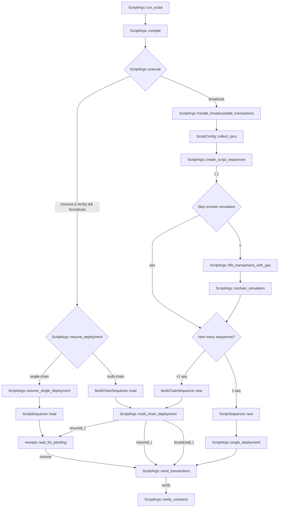
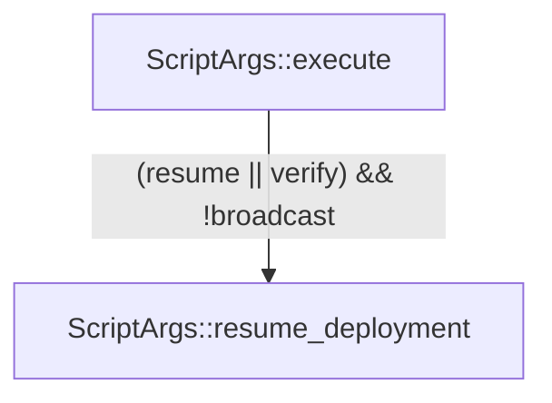
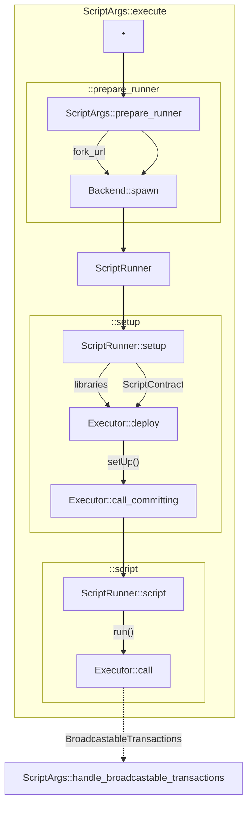

# Scripting - Flow Diagrams

1. [High level overview](#high-level-overview)
    1. [Notes](#notes)
2. [Script Execution](#script-execution)

## High level overview

### Notes
1) `[..]` - concurrently executed

2) The bit below does not actually influence the state initially defined by `--broadcast`. It only happens because there might be private keys declared inside the script that need to be collected again. `--resume` only resumes **publishing** the transactions, nothing more!

3) `ScriptArgs::execute` executes the script, while `ScriptArgs::onchain_simulation` only executes the broadcastable transactions collected by `ScriptArgs::execute`.

## Script Execution

