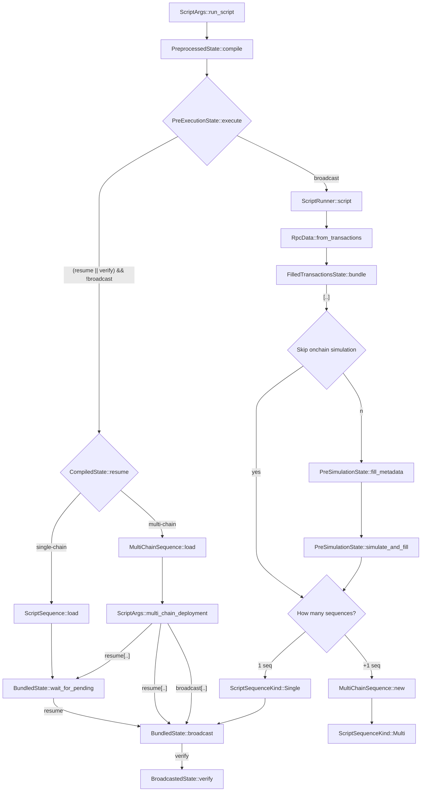
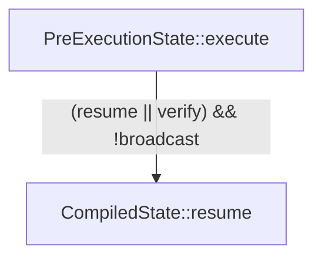
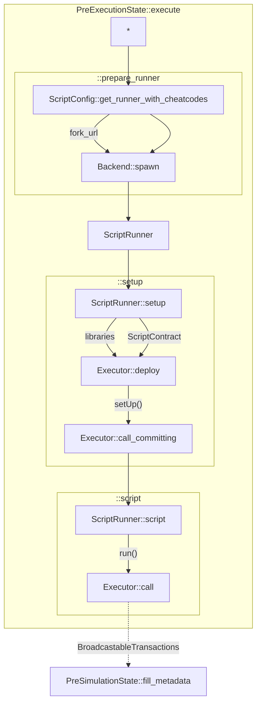
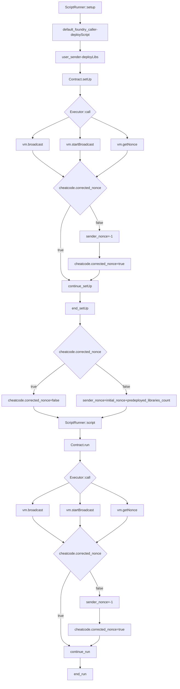

# Scripting

- [Scripting](#scripting)
  - [High level overview](#high-level-overview)
    - [Notes](#notes)
  - [Script Execution](#script-execution)
  - [Nonce Management](#nonce-management)

## High level overview

### Notes

1. `[..]` - concurrently executed

2. The bit below does not actually influence the state initially defined by `--broadcast`. It only happens because there might be private keys declared inside the script that need to be collected again. `--resume` only resumes **publishing** the transactions, nothing more!

3. `PreExecutionState::execute` executes the script, while `PreSimulationState::simulate_and_fill` executes the broadcastable transactions collected by `ScriptRunner::script`.

## Script Execution

## Nonce Management

During the first execution stage on `forge script`, foundry has to adjust the nonce from the sender to make sure the execution and state are as close as possible to its on-chain representation.

Making sure that `msg.sender` is our signer when calling `setUp()` and `run()` and that its nonce is correct (decreased by one on each call) when calling `vm.broadcast` to create a contract.

We skip this, if the user hasn't set a sender and they're using the `Config::DEFAULT_SENDER`.

