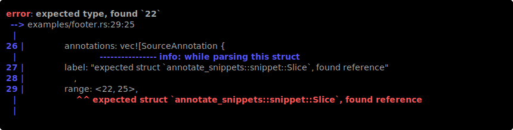

# annotate-snippets

`annotate-snippets` is a Rust library for annotation of programming code slices.

[][Documentation]

The library helps visualize meta information annotating source code slices.
It takes a data structure called `Snippet` on the input and produces a `String`
which may look like this:

Local Development
-----------------

    cargo build
    cargo test

When submitting a PR please use  [`cargo fmt`][] (nightly).

[`cargo fmt`]: https://github.com/rust-lang/rustfmt

[Documentation]: https://docs.rs/annotate-snippets/
