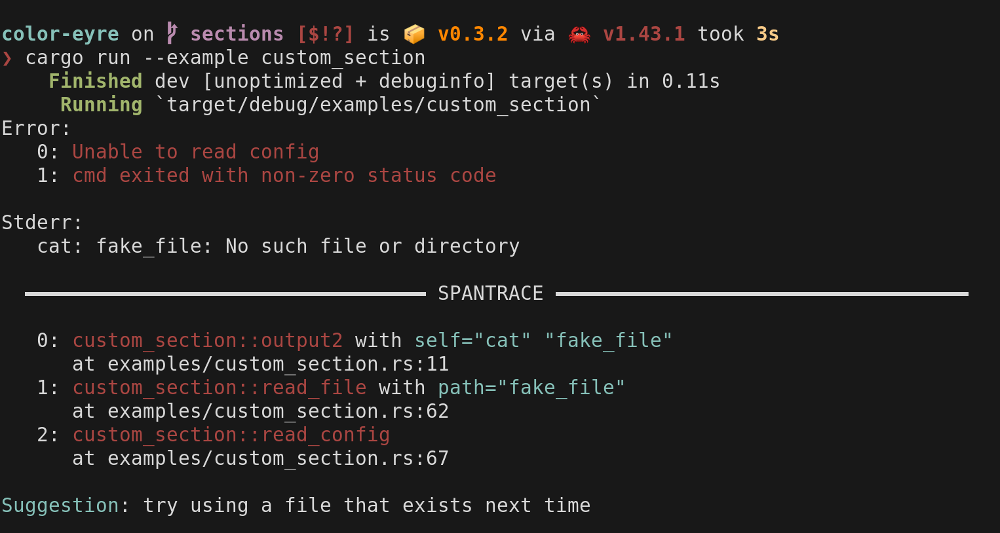
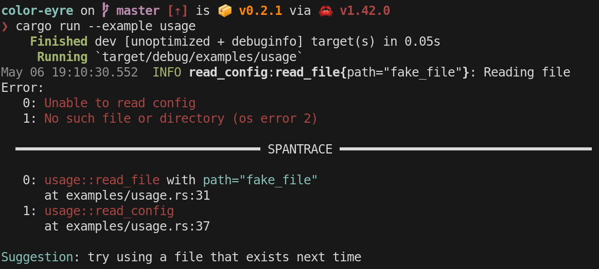
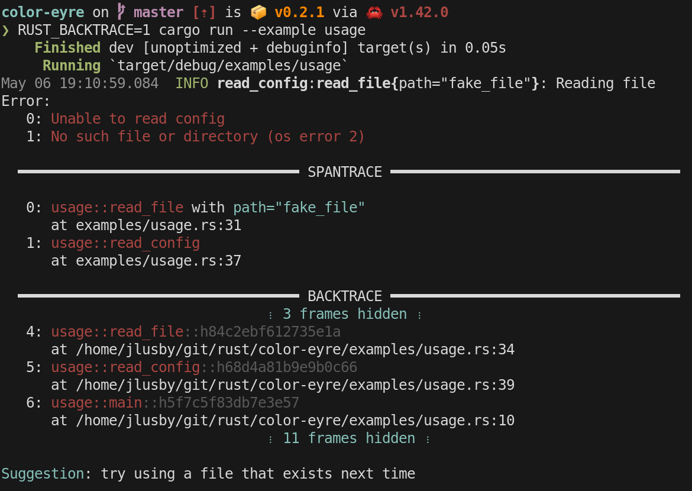
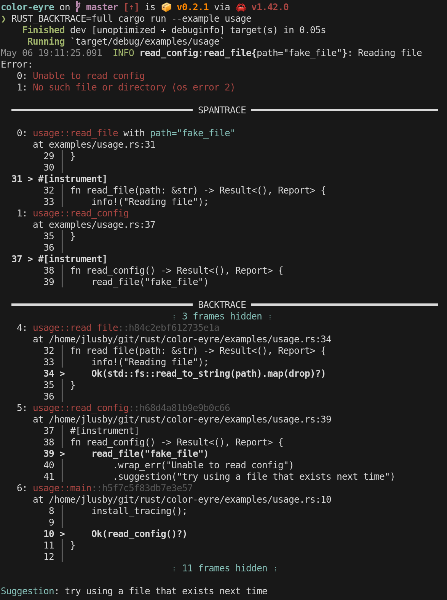

# color-eyre

[![Build Status][actions-badge]][actions-url]
[![Latest Version][version-badge]][version-url]
[![Rust Documentation][docs-badge]][docs-url]

[actions-badge]: https://github.com/eyre-rs/eyre/workflows/Continuous%20integration/badge.svg
[actions-url]: https://github.com/eyre-rs/eyre/actions?query=workflow%3A%22Continuous+integration%22
[version-badge]: https://img.shields.io/crates/v/color-eyre.svg
[version-url]: https://crates.io/crates/color-eyre
[docs-badge]: https://img.shields.io/badge/docs-latest-blue.svg
[docs-url]: https://docs.rs/color-eyre

An error report handler for panics and the [`eyre`] crate for colorful, consistent, and well
formatted error reports for all kinds of errors.

## TLDR

`color_eyre` helps you build error reports that look like this:



## Setup

Add the following to your toml file:

```toml
[dependencies]
color-eyre = "0.6"
```

And install the panic and error report handlers:

```rust
use color_eyre::eyre::Result;

fn main() -> Result<()> {
    color_eyre::install()?;

    // ...
    # Ok(())
}
```

### Disabling tracing support

If you don't plan on using `tracing_error` and `SpanTrace` you can disable the
tracing integration to cut down on unused dependencies:

```toml
[dependencies]
color-eyre = { version = "0.6", default-features = false }
```

### Disabling SpanTrace capture by default

color-eyre defaults to capturing span traces. This is because `SpanTrace`
capture is significantly cheaper than `Backtrace` capture. However, like
backtraces, span traces are most useful for debugging applications, and it's
not uncommon to want to disable span trace capture by default to keep noise out
developer.

To disable span trace capture you must explicitly set one of the env variables
that regulate `SpanTrace` capture to `"0"`:

```rust
if std::env::var("RUST_SPANTRACE").is_err() {
    std::env::set_var("RUST_SPANTRACE", "0");
}
```

### Improving perf on debug builds

In debug mode `color-eyre` behaves noticably worse than `eyre`. This is caused
by the fact that `eyre` uses `std::backtrace::Backtrace` instead of
`backtrace::Backtrace`. The std version of backtrace is precompiled with
optimizations, this means that whether or not you're in debug mode doesn't
matter much for how expensive backtrace capture is, it will always be in the
10s of milliseconds to capture. A debug version of `backtrace::Backtrace`
however isn't so lucky, and can take an order of magnitude more time to capture
a backtrace compared to its std counterpart.

Cargo [profile
overrides](https://doc.rust-lang.org/cargo/reference/profiles.html#overrides)
can be used to mitigate this problem. By configuring your project to always
build `backtrace` with optimizations you should get the same performance from
`color-eyre` that you're used to with `eyre`. To do so add the following to
your Cargo.toml:

```toml
[profile.dev.package.backtrace]
opt-level = 3
```

## Features

### Multiple report format verbosity levels

`color-eyre` provides 3 different report formats for how it formats the captured `SpanTrace`
and `Backtrace`, minimal, short, and full. Take the below snippets of the output produced by [`examples/usage.rs`]:

---

Running `cargo run --example usage` without `RUST_LIB_BACKTRACE` set will produce a minimal
report like this:



<br>

Running `RUST_LIB_BACKTRACE=1 cargo run --example usage` tells `color-eyre` to use the short
format, which additionally capture a [`backtrace::Backtrace`]:



<br>

Finally, running `RUST_LIB_BACKTRACE=full cargo run --example usage` tells `color-eyre` to use
the full format, which in addition to the above will attempt to include source lines where the
error originated from, assuming it can find them on the disk.



### Custom `Section`s for error reports via [`Section`] trait

The `section` module provides helpers for adding extra sections to error
reports. Sections are disinct from error messages and are displayed
independently from the chain of errors. Take this example of adding sections
to contain `stderr` and `stdout` from a failed command, taken from
[`examples/custom_section.rs`]:

```rust
use color_eyre::{eyre::eyre, SectionExt, Section, eyre::Report};
use std::process::Command;
use tracing::instrument;

trait Output {
    fn output2(&mut self) -> Result<String, Report>;
}

impl Output for Command {
    #[instrument]
    fn output2(&mut self) -> Result<String, Report> {
        let output = self.output()?;

        let stdout = String::from_utf8_lossy(&output.stdout);

        if !output.status.success() {
            let stderr = String::from_utf8_lossy(&output.stderr);
            Err(eyre!("cmd exited with non-zero status code"))
                .with_section(move || stdout.trim().to_string().header("Stdout:"))
                .with_section(move || stderr.trim().to_string().header("Stderr:"))
        } else {
            Ok(stdout.into())
        }
    }
}
```

---

Here we have an function that, if the command exits unsuccessfully, creates a
report indicating the failure and attaches two sections, one for `stdout` and
one for `stderr`.

Running `cargo run --example custom_section` shows us how these sections are
included in the output:


Only the `Stderr:` section actually gets included. The `cat` command fails,
so stdout ends up being empty and is skipped in the final report. This gives
us a short and concise error report indicating exactly what was attempted and
how it failed.

### Aggregating multiple errors into one report

It's not uncommon for programs like batched task runners or parsers to want
to return an error with multiple sources. The current version of the error
trait does not support this use case very well, though there is [work being
done](https://github.com/rust-lang/rfcs/pull/2895) to improve this.

For now however one way to work around this is to compose errors outside the
error trait. `color-eyre` supports such composition in its error reports via
the `Section` trait.

For an example of how to aggregate errors check out [`examples/multiple_errors.rs`].

### Custom configuration for `color-backtrace` for setting custom filters and more

The pretty printing for backtraces and span traces isn't actually provided by
`color-eyre`, but instead comes from its dependencies [`color-backtrace`] and
[`color-spantrace`]. `color-backtrace` in particular has many more features
than are exported by `color-eyre`, such as customized color schemes, panic
hooks, and custom frame filters. The custom frame filters are particularly
useful when combined with `color-eyre`, so to enable their usage we provide
the `install` fn for setting up a custom `BacktracePrinter` with custom
filters installed.

For an example of how to setup custom filters, check out [`examples/custom_filter.rs`].

[`eyre`]: https://docs.rs/eyre
[`tracing-error`]: https://docs.rs/tracing-error
[`color-backtrace`]: https://docs.rs/color-backtrace
[`eyre::EyreHandler`]: https://docs.rs/eyre/*/eyre/trait.EyreHandler.html
[`backtrace::Backtrace`]: https://docs.rs/backtrace/*/backtrace/struct.Backtrace.html
[`tracing_error::SpanTrace`]: https://docs.rs/tracing-error/*/tracing_error/struct.SpanTrace.html
[`color-spantrace`]: https://github.com/eyre-rs/eyre/tree/master/color-spantrace
[`Section`]: https://docs.rs/color-eyre/*/color_eyre/section/trait.Section.html
[`eyre::Report`]: https://docs.rs/eyre/*/eyre/struct.Report.html
[`eyre::Result`]: https://docs.rs/eyre/*/eyre/type.Result.html
[`Handler`]: https://docs.rs/color-eyre/*/color_eyre/struct.Handler.html
[`examples/usage.rs`]: https://github.com/eyre-rs/color-eyre/blob/master/examples/usage.rs
[`examples/custom_filter.rs`]: https://github.com/eyre-rs/eyre/tree/master/color-eyre/blob/master/examples/custom_filter.rs
[`examples/custom_section.rs`]: https://github.com/eyre-rs/eyre/tree/master/color-eyre/blob/master/examples/custom_section.rs
[`examples/multiple_errors.rs`]: https://github.com/eyre-rs/eyre/tree/master/color-eyre/blob/master/examples/multiple_errors.rs

#### License

<sup>
Licensed under either of <a href="LICENSE-APACHE">Apache License, Version
2.0</a> or <a href="LICENSE-MIT">MIT license</a> at your option.
</sup>

<br>

<sub>
Unless you explicitly state otherwise, any contribution intentionally submitted
for inclusion in this crate by you, as defined in the Apache-2.0 license, shall
be dual licensed as above, without any additional terms or conditions.
</sub>
