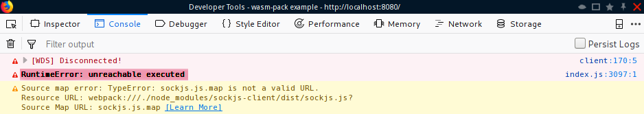
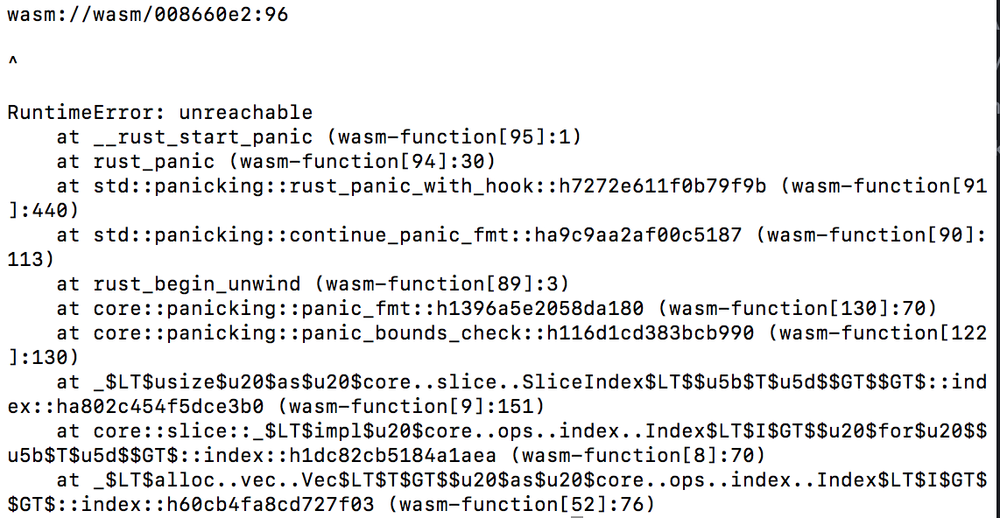
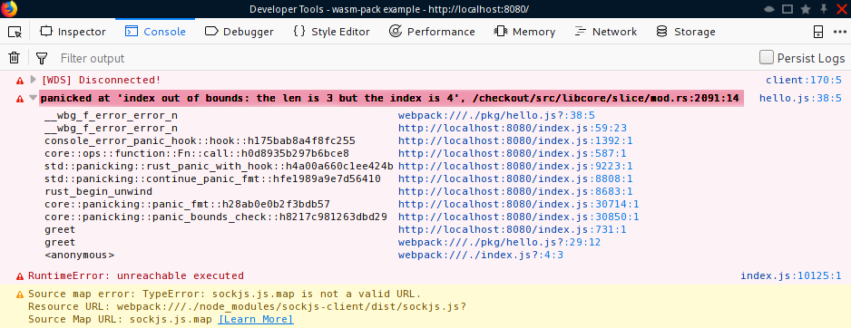
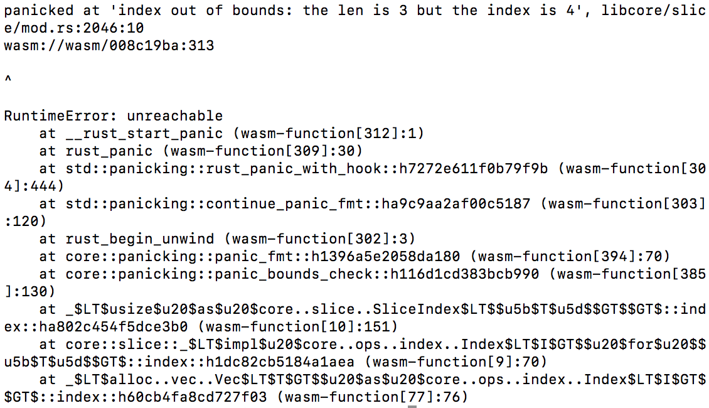

## `console_error_panic_hook`

[](https://docs.rs/console_error_panic_hook/)
[](https://crates.io/crates/console_error_panic_hook)
[](https://crates.io/crates/console_error_panic_hook)
[](https://travis-ci.org/rustwasm/console_error_panic_hook)

This crate lets you debug panics on `wasm32-unknown-unknown` by providing a
panic hook that forwards panic messages to
[`console.error`](https://developer.mozilla.org/en-US/docs/Web/API/Console/error).

When an error is reported with `console.error`, browser devtools and node.js
will typically capture a stack trace and display it with the logged error
message.

Without `console_error_panic_hook` you just get something like *RuntimeError: Unreachable executed*

Browser:


Node:


With this panic hook installed you will see the panic message

Browser:


Node:


### Usage

There are two ways to install this panic hook.

First, you can set the hook yourself by calling `std::panic::set_hook` in
some initialization function:

```rust
extern crate console_error_panic_hook;
use std::panic;

fn my_init_function() {
    panic::set_hook(Box::new(console_error_panic_hook::hook));

    // ...
}
```

Alternatively, use `set_once` on some common code path to ensure that
`set_hook` is called, but only the one time. Under the hood, this uses
`std::sync::Once`.

```rust
extern crate console_error_panic_hook;

struct MyBigThing;

impl MyBigThing {
    pub fn new() -> MyBigThing {
        console_error_panic_hook::set_once();

        MyBigThing
    }
}
```

### Error.stackTraceLimit

Many browsers only capture the top 10 frames of a stack trace. In rust programs this is less likely to be enough. To see more frames, you can set the non-standard value `Error.stackTraceLimit`. For more information see the [MDN Web Docs](https://developer.mozilla.org/en-US/docs/Web/JavaScript/Microsoft_Extensions/Error.stackTraceLimit) or [v8 docs](https://v8.dev/docs/stack-trace-api).

